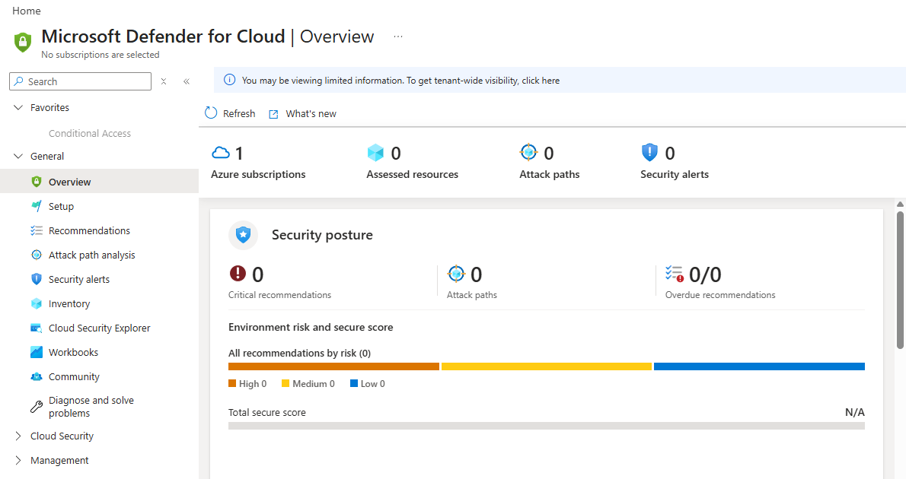
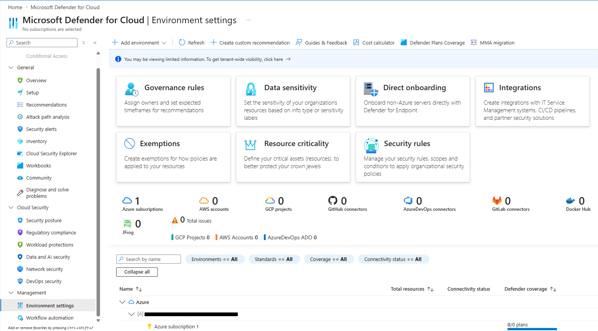
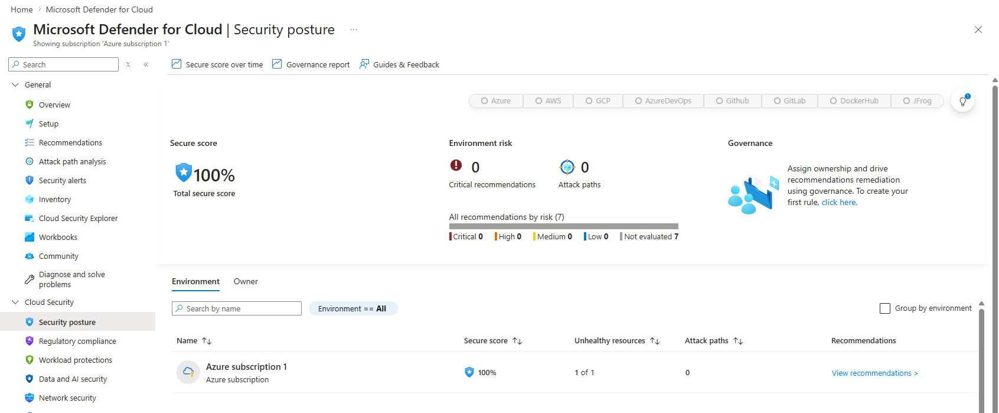
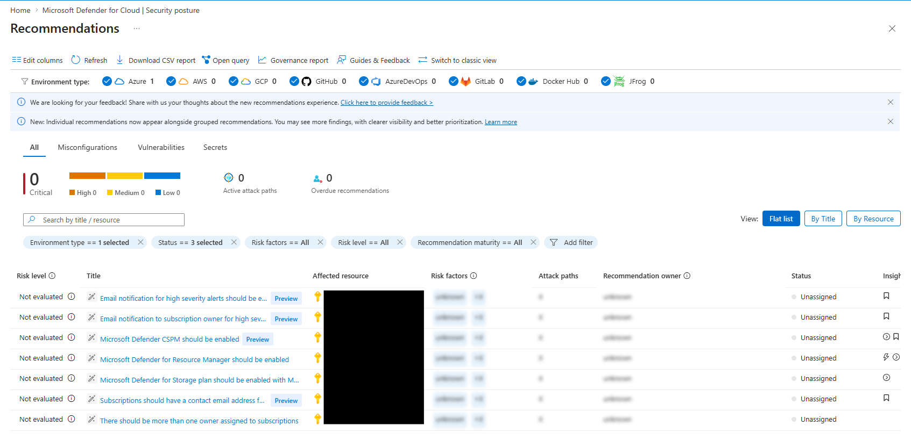
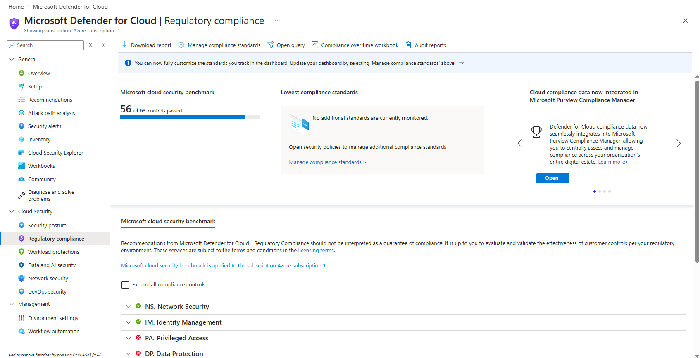

# Microsoft Defender for Cloud Security Posture Lab

## Summary

Built a Microsoft Defender for Cloud security posture lab to review cloud security visibility, Secure Score, security recommendations, environment settings, and regulatory compliance monitoring within an Azure subscription.

This project focused on understanding how Defender for Cloud helps identify cloud security risks, review subscription-level posture, and support security improvement planning.

## Objective

The goal of this project was to:

- Review Microsoft Defender for Cloud security posture features
- Understand how Secure Score and recommendations help prioritize cloud security improvements
- Explore environment settings and Defender for Cloud coverage options
- Review regulatory compliance visibility using the Microsoft Cloud Security Benchmark
- Practice documenting cloud security findings in a clear, professional format

## Tools & Technologies

- Microsoft Azure
- Microsoft Defender for Cloud
- Cloud Security Posture Management
- Cloud Secure Score
- Defender for Cloud Recommendations
- Regulatory Compliance Dashboard
- Microsoft Cloud Security Benchmark

## Environment

| Component | Details |
|---|---|
| Cloud Platform | Microsoft Azure |
| Security Platform | Microsoft Defender for Cloud |
| Subscription | Azure lab subscription |
| Focus Area | Cloud security posture management |
| Compliance Standard Reviewed | Microsoft Cloud Security Benchmark |
| Resources Assessed | Minimal lab subscription resources |

## What I Configured / Reviewed

- Opened and reviewed the Microsoft Defender for Cloud overview dashboard
- Reviewed Defender for Cloud environment settings
- Confirmed the Azure subscription was visible in Defender for Cloud
- Reviewed cloud security posture and Secure Score
- Reviewed subscription-level recommendations
- Reviewed regulatory compliance status
- Identified Microsoft Cloud Security Benchmark control results
- Documented recommendations related to security contacts, alert notifications, Defender plan enablement, and subscription ownership

## Initial Findings

| Area | Observation |
|---|---|
| Secure Score | Defender for Cloud showed a 100% Secure Score for the current lab subscription. |
| Environment Risk | No critical recommendations or attack paths were identified. |
| Recommendations | 7 recommendations were visible, with several marked as not evaluated. |
| Resources | Defender identified 1 unhealthy resource out of 1 assessed resource. |
| Regulatory Compliance | Microsoft Cloud Security Benchmark was applied to the subscription. |
| Compliance Status | 56 of 63 controls were shown as passed. |
| Additional Standards | No additional compliance standards were monitored at this stage. |

## Recommendation Review

| Recommendation | Status | Why it matters | Possible action |
|---|---|---|---|
| Email notification for high severity alerts should be enabled | Not evaluated | Ensures security teams are notified when important Defender alerts are generated. | Configure security contact and alert notification settings. |
| Subscriptions should have a contact email address | Not evaluated | Provides a point of contact for security notifications and subscription-level communication. | Add a security contact email for the subscription. |
| There should be more than one owner assigned to subscriptions | Not evaluated | Reduces the risk of losing administrative access if a single owner account is unavailable. | Assign at least one additional trusted owner or emergency access account. |

## Screenshots

### Defender for Cloud Overview

Reviewed the Microsoft Defender for Cloud overview page to understand the subscription's security posture, assessed resources, attack paths, security alerts, and Secure Score visibility.

### Defender Environment Settings

Reviewed Defender for Cloud environment settings to confirm the Azure subscription was visible and to identify available governance, integration, and environment-level security configuration options.

### Cloud Security Posture

Reviewed the Defender for Cloud security posture page to assess Secure Score, environment risk, recommendations, and subscription-level cloud security posture.

### Security Recommendations

Reviewed Defender for Cloud security recommendations to identify subscription-level security posture items, including alert notification settings, Defender plan enablement, contact configuration, and subscription ownership recommendations.

### Regulatory Compliance Dashboard

Reviewed the Defender for Cloud regulatory compliance dashboard to understand how the Azure subscription is assessed against the Microsoft Cloud Security Benchmark and related security control categories.

## Results

This project successfully demonstrated:

- Basic navigation of Microsoft Defender for Cloud
- Review of cloud security posture using Secure Score
- Identification of subscription-level security recommendations
- Review of Defender for Cloud environment settings
- Awareness of Defender plan and coverage visibility
- Review of compliance posture using the Microsoft Cloud Security Benchmark
- Documentation of cloud security posture findings in a professional format

## Key Takeaways

- Microsoft Defender for Cloud provides centralized visibility into Azure security posture.
- Secure Score helps summarize the current security posture of a cloud environment.
- Security recommendations help identify configuration gaps and improvement opportunities.
- Regulatory compliance dashboards help map Azure resources to security standards and control categories.
- Subscription-level settings such as security contacts, alert notifications, and ownership are important for operational readiness.
- A small lab subscription may show limited findings because there are few resources for Defender to assess.

## Real-World Relevance

This project relates to cloud security operations by demonstrating how an organization can review Azure security posture, identify recommended security improvements, and monitor compliance alignment through Microsoft Defender for Cloud.

In a business or managed services environment, this type of review can support:

- Cloud security posture reviews
- Compliance visibility
- Risk prioritization
- Ongoing security improvement planning
