# Azure RBAC and Policy Lab

## Summary

Built an Azure RBAC and governance lab to practice least-privilege access control using a service principal, custom Azure RBAC role, and Azure Policy.

This project focused on creating a non-human Azure identity for automation-style access, assigning it a limited custom role at the resource group scope, validating allowed and denied actions with Azure CLI, and enforcing a storage security policy to prevent public blob access.

## Objective

The goal of this project was to:

- Create a service principal to simulate automation-based Azure access
- Build a custom Azure RBAC role using least-privilege permissions
- Assign the custom role at the resource group scope
- Validate the service principal’s allowed and denied actions using Azure CLI
- Assign Azure Policy to prevent storage accounts from allowing public blob access
- Confirm policy enforcement by testing non-compliant and compliant storage account configurations
- Practice secure cleanup by deleting the client secret after testing

## Tools & Technologies

- Microsoft Azure Portal
- Microsoft Entra ID
- Azure App Registrations
- Azure Service Principals
- Azure Role-Based Access Control
- Custom Azure RBAC Roles
- Azure Policy
- Azure Storage Accounts
- Azure Cloud Shell
- Azure CLI

## Environment

| Component | Details |
|---|---|
| Cloud Platform | Microsoft Azure |
| Identity Platform | Microsoft Entra ID |
| Resource Group | `rg-rbac-policy-lab` |
| Region | West US 2 |
| Service Principal | `sp-rbac-policy-lab` |
| Custom Role | `Storage Governance Operator` |
| Policy Assignment | `deny-storage-public-access` |
| Storage Account | `strbacpolicy1515` |
| Security Controls | Custom RBAC, Azure Policy, storage public access restriction |
| Testing Method | Azure Cloud Shell / Azure CLI |

## What I Configured

- Created a dedicated resource group for RBAC and Azure Policy testing
- Created a standard Azure storage account for permission validation
- Configured secure storage settings including secure transfer, TLS 1.2, and disabled anonymous blob access
- Registered an application in Microsoft Entra ID
- Created a service principal for automation-style Azure access
- Created a temporary client secret for Azure CLI authentication
- Built a custom Azure RBAC role named `Storage Governance Operator`
- Added limited read-focused permissions for resource group and storage account visibility
- Scoped the custom role to the `rg-rbac-policy-lab` resource group
- Assigned the custom role to the `sp-rbac-policy-lab` service principal
- Authenticated to Azure CLI using the service principal
- Tested allowed read actions against the resource group and storage account
- Tested denied actions including VM creation and resource group deletion
- Assigned an Azure Policy to deny storage accounts that allow public blob access
- Validated that non-compliant storage configuration was denied
- Validated that compliant storage configuration passed policy checks
- Deleted the client secret after testing to reduce credential exposure risk

## Screenshots

### Resource Group Overview

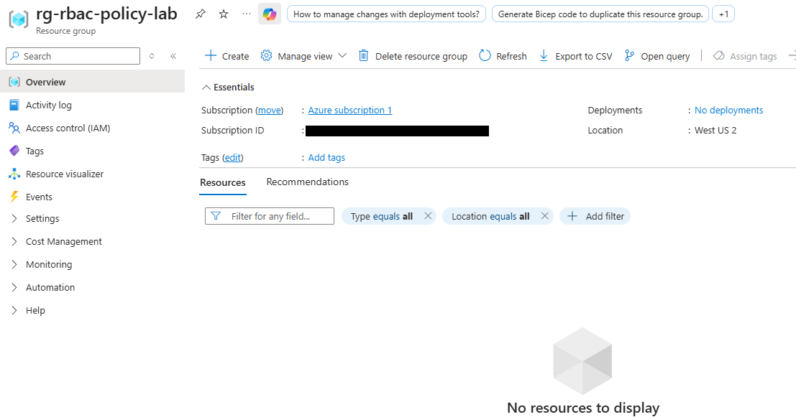

This screenshot shows the dedicated resource group created for the RBAC and Policy lab. The resource group provided a controlled scope for testing custom role assignment and Azure Policy enforcement.

### Storage Account Review and Create

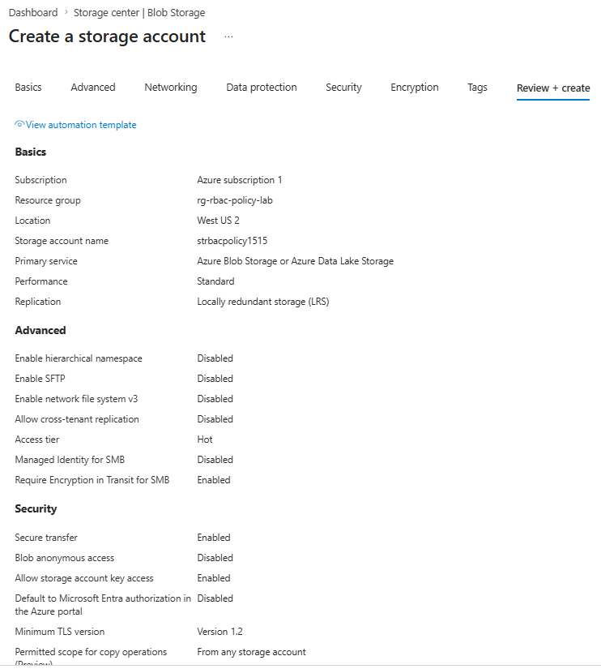

This screenshot shows the storage account configuration before deployment, including the selected resource group, region, performance tier, redundancy option, and security-related settings.

### Storage Account Overview

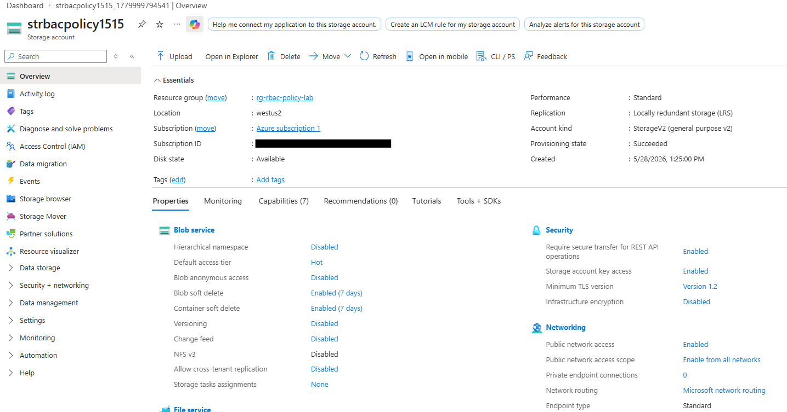

This screenshot shows the deployed storage account used for RBAC permission testing. The storage account was created in the `rg-rbac-policy-lab` resource group.

### Storage Security Configuration

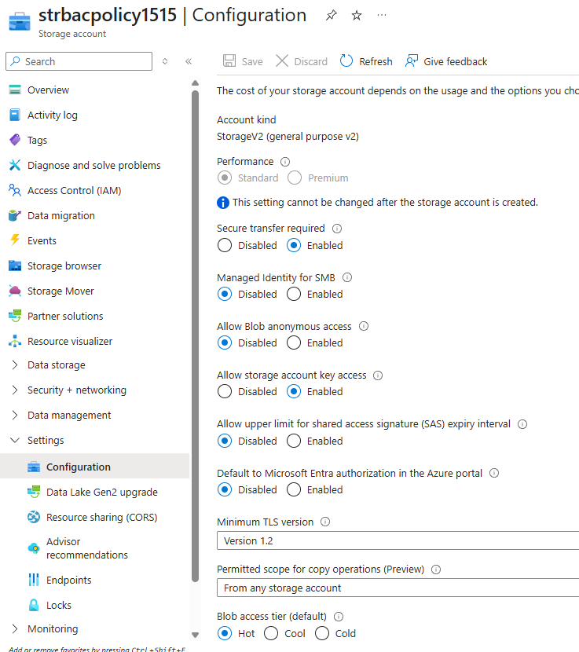

This screenshot shows the storage account security configuration, including secure transfer, minimum TLS version, and disabled anonymous blob access.

### Service Principal Overview

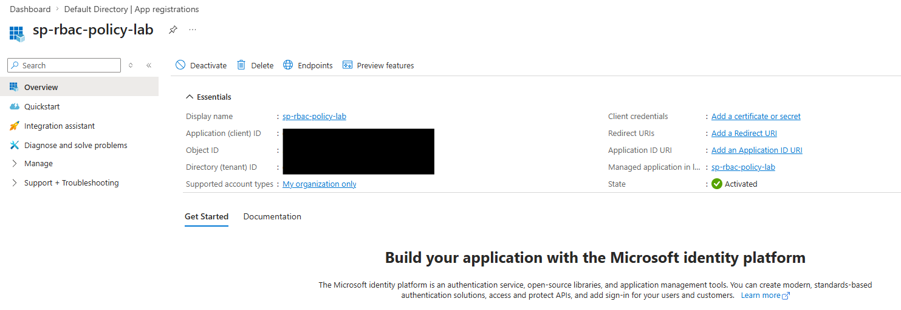

This screenshot shows the app registration/service principal created for the lab. The service principal was used to simulate a non-human identity that could be used by automation, scripts, or deployment pipelines.

### Client Secret Created

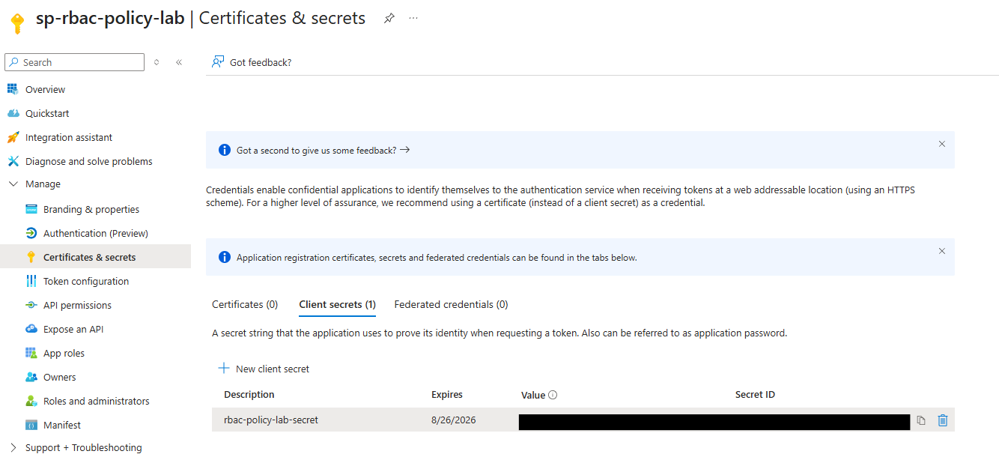

This screenshot shows that a client secret was created for the service principal. The secret value was not exposed in the screenshot.

### Custom Role Basics

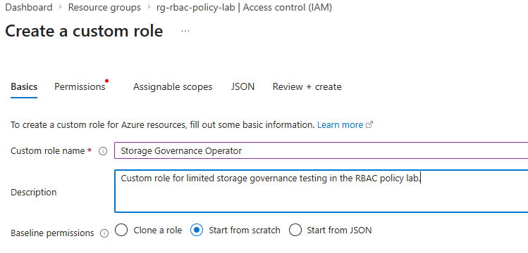

This screenshot shows the basic configuration for the custom Azure RBAC role named `Storage Governance Operator`.

### Custom Role Permissions

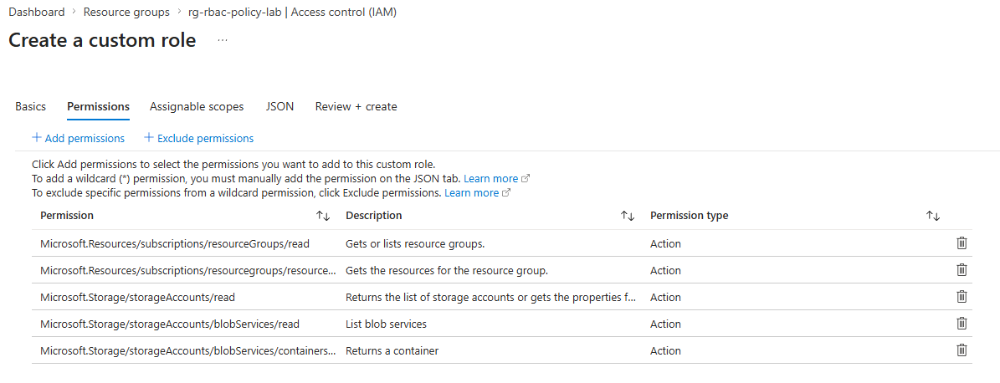

This screenshot shows the limited permissions assigned to the custom role. The role was designed to allow read-focused access to resource group and storage account information without granting broad Contributor or Owner permissions.

### Custom Role Assignable Scope

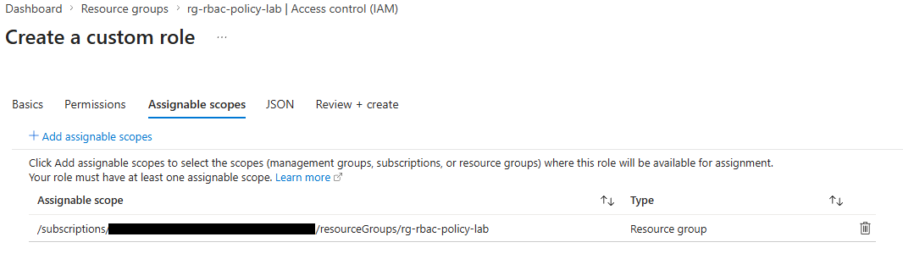

This screenshot shows the assignable scope for the custom role. The role was scoped to the `rg-rbac-policy-lab` resource group to limit where it could be assigned.

### Custom Role Created

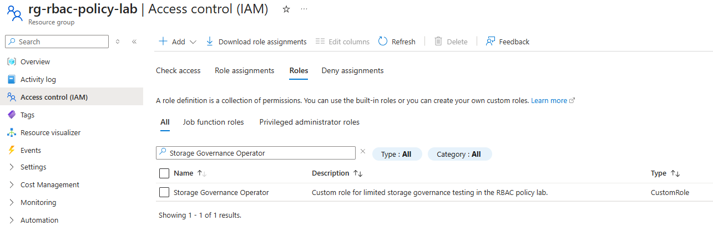

This screenshot shows the custom role after creation, confirming that `Storage Governance Operator` was available for assignment.

### Role Assignment Review

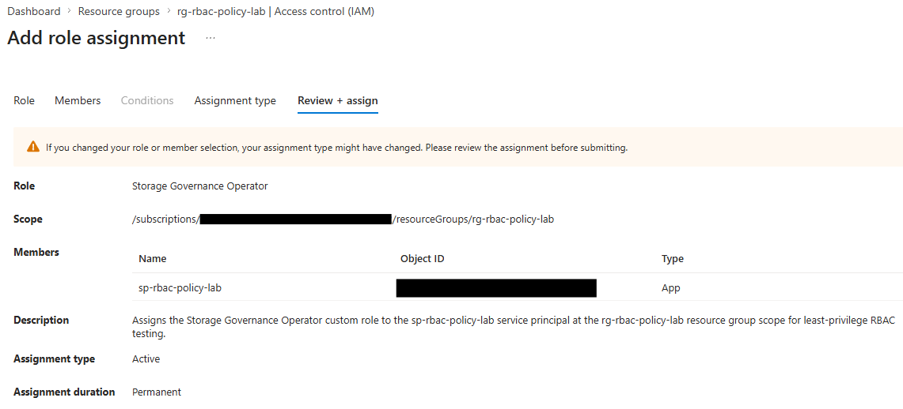

This screenshot shows the custom role assignment review before applying it to the service principal.

### Service Principal Role Assignment

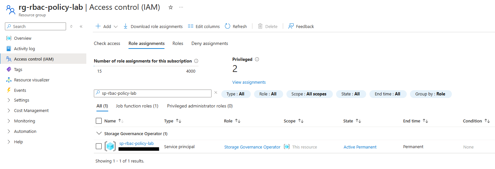

This screenshot shows the `Storage Governance Operator` role assigned to the `sp-rbac-policy-lab` service principal at the resource group scope.

### Service Principal CLI Login

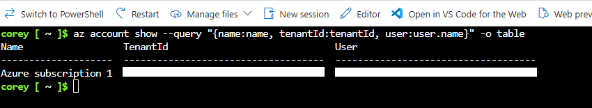

This screenshot shows successful Azure CLI authentication using the service principal. The client secret was cleared from the terminal before capturing the screenshot.

### Allowed Resource List Test

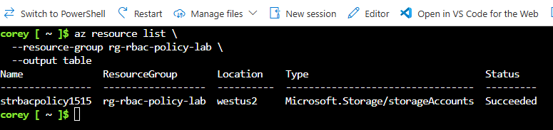

This screenshot shows the service principal successfully listing resources inside the assigned resource group. This validated that the custom role allowed the expected read action.

### Allowed Storage Read Test

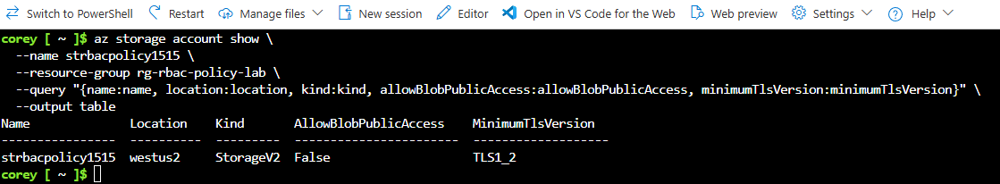

This screenshot shows the service principal successfully reading storage account properties. This confirmed that the custom role allowed limited storage account visibility.

### Denied VM Create Test

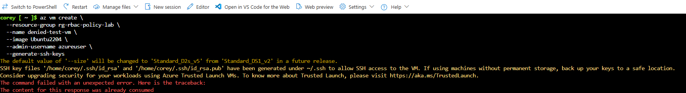

This screenshot shows the service principal being denied when attempting to create a virtual machine. This confirmed that the custom role did not include compute deployment permissions.

### Denied Resource Group Delete Test

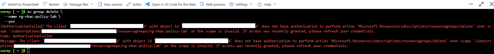

This screenshot shows the service principal being denied when attempting to delete the resource group. This confirmed that the custom role did not include destructive resource group permissions.

### Policy Definition for Public Blob Access

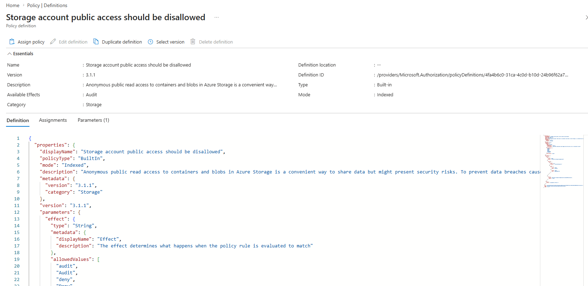

This screenshot shows the built-in Azure Policy definition used to prevent storage accounts from allowing public blob access.

### Policy Assignment Review

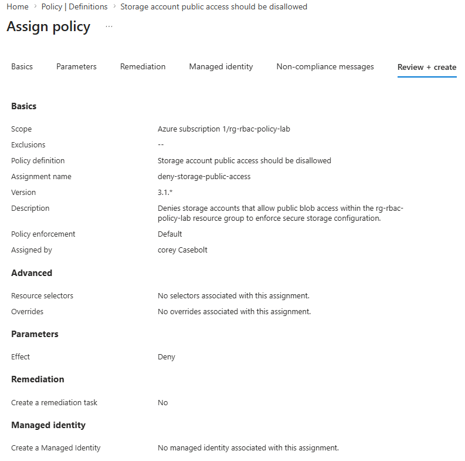

This screenshot shows the Azure Policy assignment review before creation. The policy was assigned to the `rg-rbac-policy-lab` resource group.

### Policy Assignment Overview

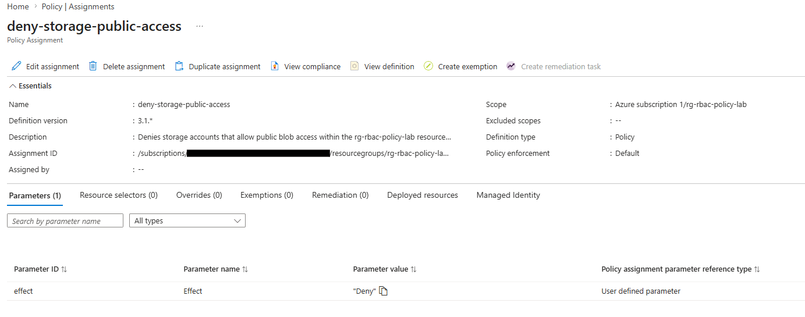

This screenshot shows the completed policy assignment named `deny-storage-public-access`.

### Policy Denied Storage Public Access

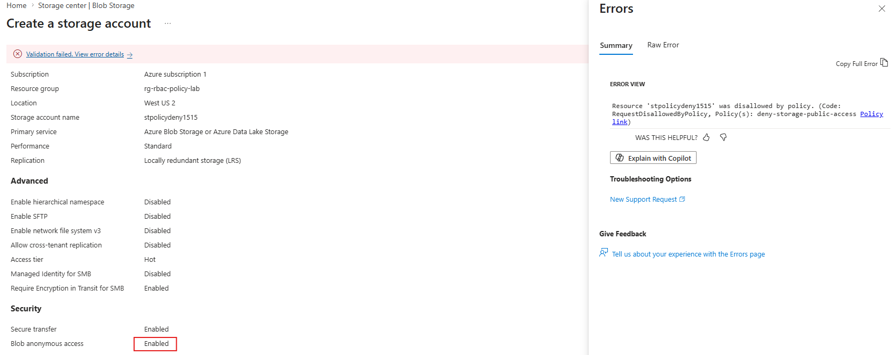

This screenshot shows Azure Policy denying a non-compliant storage account configuration that allowed public blob access.

### Policy Compliant Storage Validation

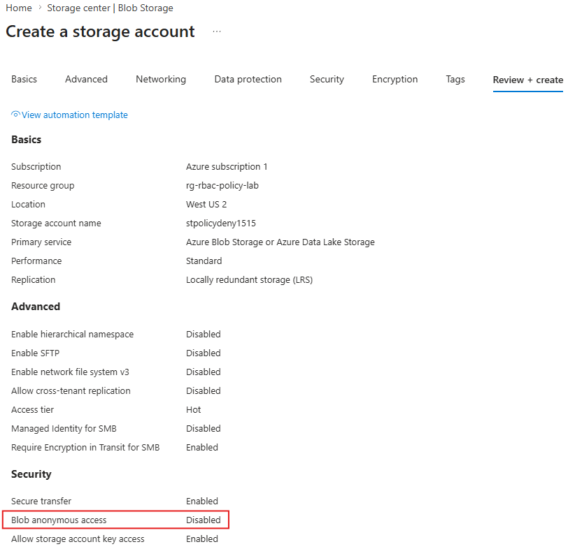

This screenshot shows that a compliant storage account configuration passed validation after public blob access was disabled.

### Client Secret Deleted

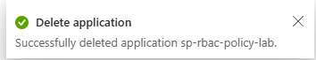

This screenshot shows the client secret being deleted after testing. This cleanup step reduced the risk of leaving an unnecessary credential active.

## Results

This project successfully demonstrated:

- Creation of a service principal for automation-style Azure access
- Creation of a custom Azure RBAC role using least-privilege permissions
- Assignment of the custom role to a service principal at resource group scope
- Successful authentication to Azure CLI as the service principal
- Validation that allowed read actions worked as expected
- Validation that unauthorized actions were denied
- Azure Policy assignment at the resource group scope
- Enforcement of a policy blocking storage accounts that allow public blob access
- Successful validation of compliant storage configuration
- Secure cleanup by deleting the client secret after testing

## Key Takeaways

- Service principals are used for non-human identities such as scripts, applications, automation, and deployment pipelines.
- Azure RBAC controls what an identity can do to Azure resources.
- Custom roles can enforce least privilege by granting only the permissions required for a specific task.
- Assigning roles at the resource group scope limits the impact of the identity.
- Testing both allowed and denied actions is important for validating access control.
- Azure Policy helps enforce governance by preventing or auditing insecure resource configurations.
- Denying public blob access helps reduce the risk of accidental public exposure of storage data.
- Client secrets should be protected carefully and removed when they are no longer needed.

## Real-World Relevance

This project relates to real cloud administration and security operations by demonstrating how access control and governance are managed in Azure.

In a business environment, cloud administrators and security teams commonly need to:

- Create service principals for automation and deployment workflows
- Assign limited permissions to non-human identities
- Avoid granting broad Owner or Contributor permissions when they are not required
- Validate that identities can only perform approved actions
- Use Azure Policy to enforce secure configuration standards
- Prevent accidental public exposure of cloud storage
- Remove unused credentials to reduce security risk

This lab provides practical experience with Azure RBAC, service principals, custom roles, policy enforcement, and least-privilege cloud access design.
