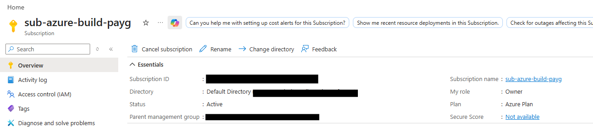
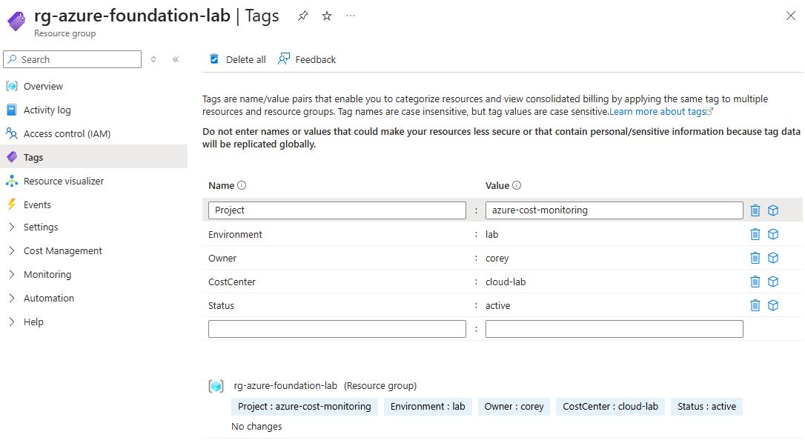
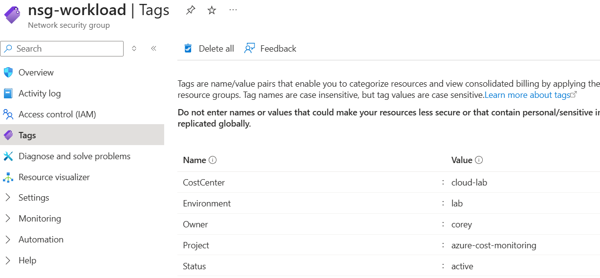
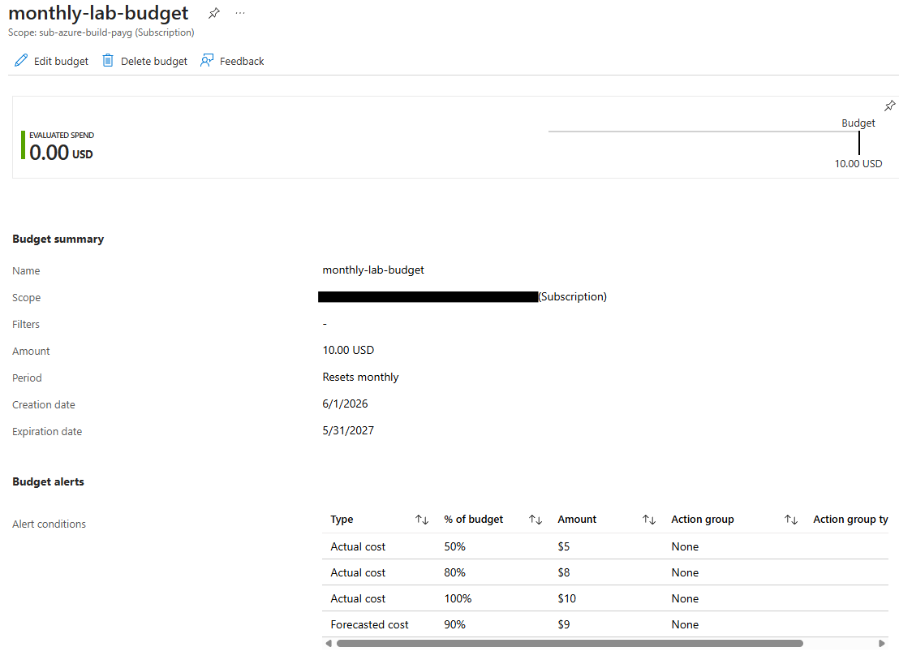
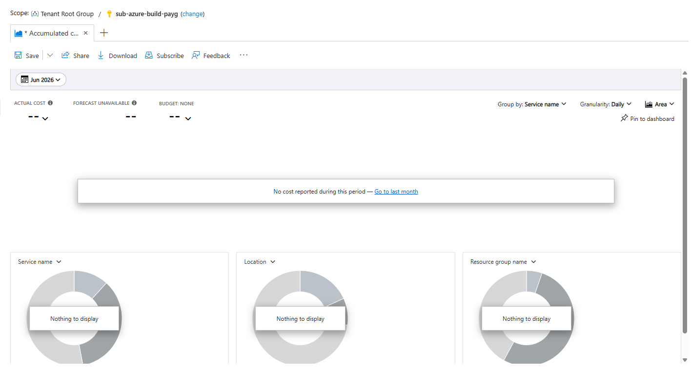
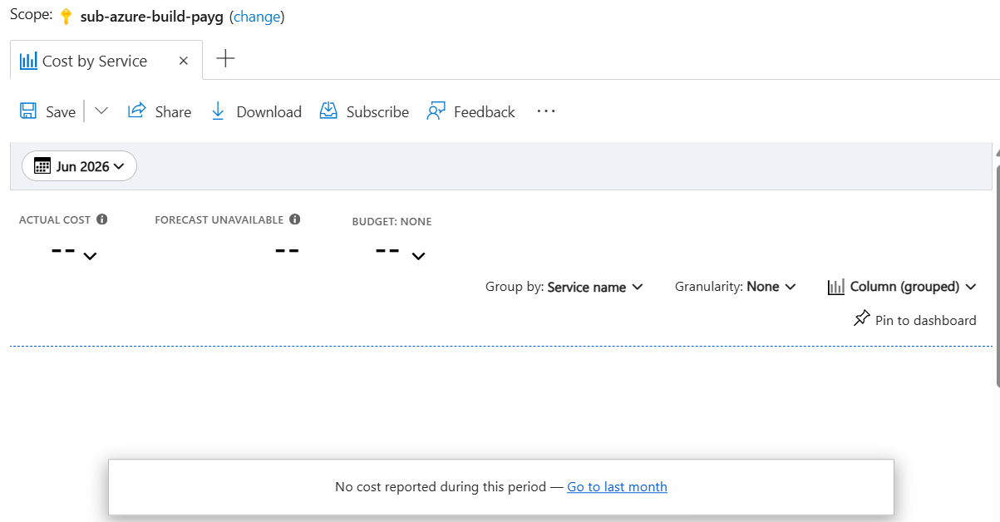
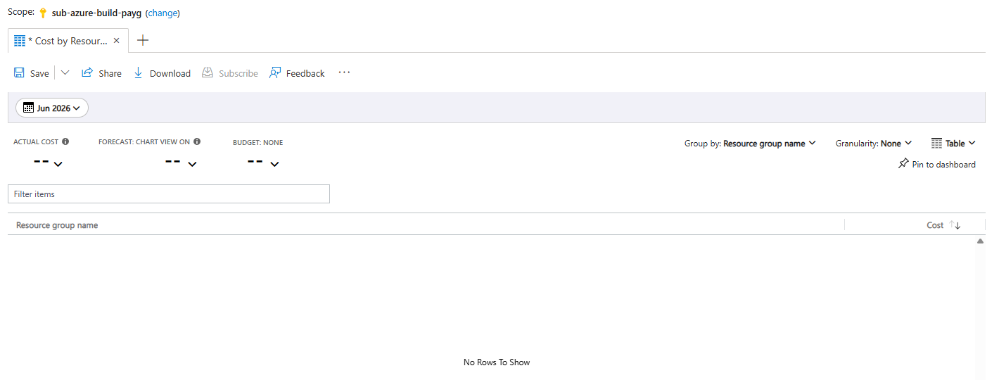
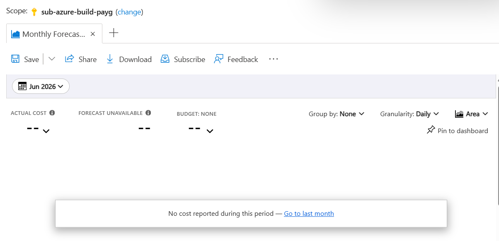
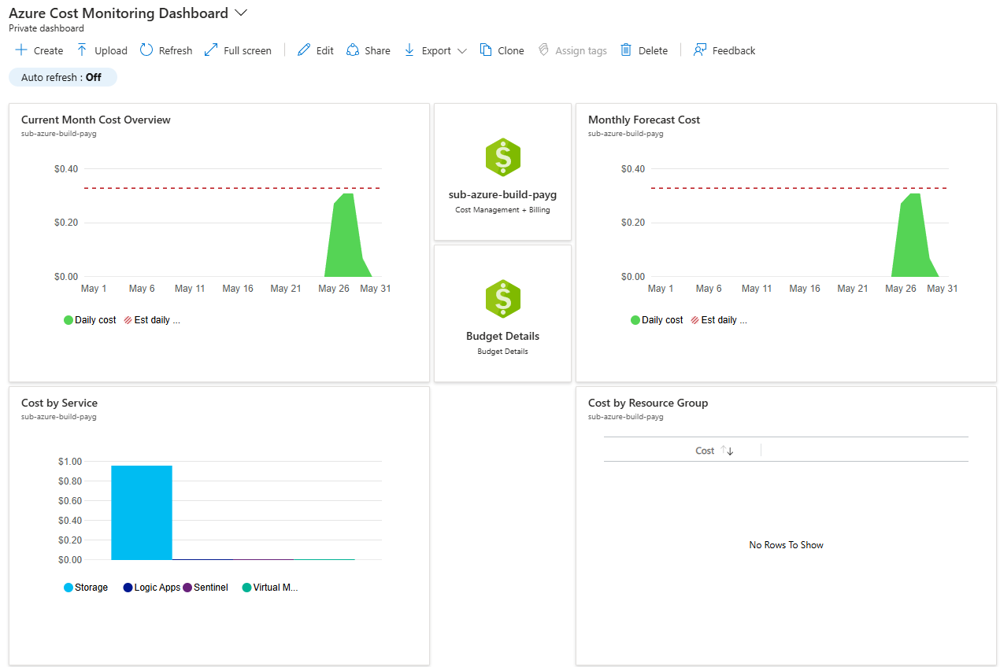
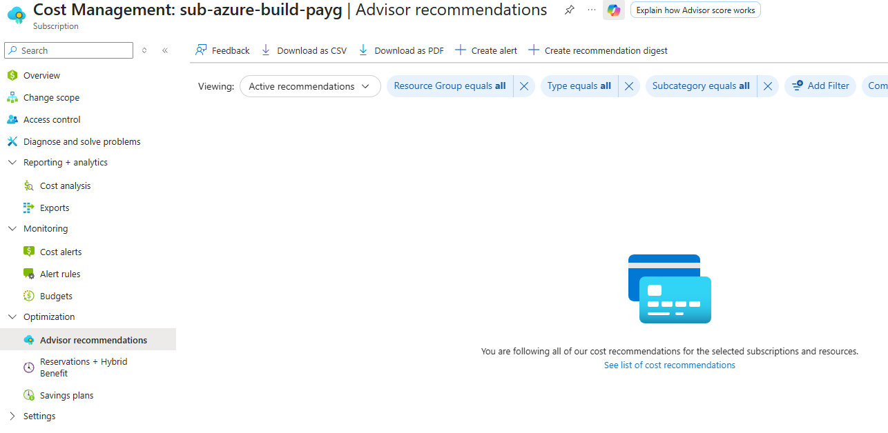

# Azure Cost Monitoring Dashboard

## Summary

This project demonstrates a lightweight Azure cost monitoring and budget control setup for a cloud security lab subscription. The goal was to create visibility into Azure spending, configure budget alerts, organize resources with cost allocation tags, and build dashboard-style cost views similar to what a small organization might use for basic cloud cost governance.

The project was completed after upgrading an Azure lab subscription from a free trial to Pay-As-You-Go and cleaning up unused billable resources.

## Objective

The goal of this project was to:

- Upgrade and maintain an Azure lab subscription under Pay-As-You-Go
- Reduce the risk of unexpected Azure costs
- Configure a monthly budget with alert thresholds
- Apply resource tags for cost allocation and governance
- Create reusable Azure Cost Analysis views
- Build a dashboard for monitoring subscription spending
- Review Azure Advisor cost recommendations

## Tools & Services

- Microsoft Azure Portal
- Azure Cost Management + Billing
- Azure Budgets
- Azure Cost Analysis
- Azure Dashboards
- Azure Advisor
- Azure Resource Tags

## Environment

| Component | Details |
|---|---|
| Cloud Platform | Microsoft Azure |
| Subscription | `sub-azure-build-payg` |
| Billing Model | Pay-As-You-Go |
| Resource Group | `rg-azure-foundation-lab` |
| Dashboard Name | Azure Cost Monitoring Dashboard |
| Budget Name | `monthly-lab-budget` |
| Budget Amount | $10/month |
| Budget Scope | Subscription |
| Primary Tags | Project, Environment, Owner, CostCenter, Status |

## What I Configured

- Upgraded the Azure lab subscription to Pay-As-You-Go
- Removed unused billable lab resources before continuing with the subscription
- Created a monthly budget for the Azure lab subscription
- Configured budget alert thresholds at 50%, 80%, 90% forecasted, and 100%
- Applied cost allocation tags to the remaining lab resources
- Created reusable Cost Analysis views for subscription cost monitoring
- Built a custom Azure dashboard for cost visibility
- Reviewed Azure Advisor cost recommendations for the subscription

## Budget Configuration

A monthly budget was created to help control cloud lab spending.

| Setting | Value |
|---|---|
| Budget Name | `monthly-lab-budget` |
| Scope | Subscription |
| Amount | $10/month |
| Reset Period | Monthly |
| Alert 1 | 50% actual cost |
| Alert 2 | 80% actual cost |
| Alert 3 | 90% forecasted cost |
| Alert 4 | 100% actual cost |

This budget provides early warning if lab resources begin generating unexpected costs.

## Tagging Strategy

Resource tags were applied to support cost allocation and governance.

| Tag | Value |
|---|---|
| Project | `azure-cost-monitoring` |
| Environment | `lab` |
| Owner | `corey` |
| CostCenter | `cloud-lab` |
| Status | `active` |

At the time of setup, no active billable tagged resources were running, so Cost Analysis did not yet display tag-based cost data. The tagging structure prepares the subscription for future project-based reporting as additional Azure lab resources generate usage.

## Dashboard Views

The Azure Cost Monitoring Dashboard includes several cost-focused views.

| Dashboard Section | Purpose |
|---|---|
| Current Month Cost Overview | Shows daily subscription spend for the selected month |
| Monthly Forecast Cost | Shows projected cost trend when forecast data is available |
| Cost by Service | Breaks down spending by Azure service |
| Cost by Resource Group | Shows which resource groups are generating cost |
| Budget Details | Provides quick access to the monthly budget |
| Subscription Cost Management Tile | Provides quick access to Cost Management + Billing |

This layout provides a simple enterprise-style view of current spend, service-level costs, resource group costs, and budget tracking.

## Screenshots

### Subscription Overview

This screenshot shows the Azure lab subscription after it was upgraded and renamed for Pay-As-You-Go use.

### Resource Group Tags

This screenshot shows the cost allocation tags applied to the lab resource group.

### Resource Tags Example

This screenshot shows an example of the tagging structure applied to individual Azure resources.

### Monthly Budget Created

This screenshot shows the monthly Azure budget configured at the subscription scope, including the $10 budget amount and alert thresholds.

### Current Month Cost Overview

This Cost Analysis view shows the current month spending trend for the subscription.

### Cost by Service

This Cost Analysis view breaks down Azure spending by service.

### Cost by Resource Group

This Cost Analysis view shows subscription spending grouped by resource group.

### Monthly Cost Forecast

This Cost Analysis view was created to monitor monthly forecasted costs. Forecasting was unavailable at the time of setup because there was limited current-month spend data.

### Azure Cost Monitoring Dashboard

This screenshot shows the custom Azure dashboard with cost overview, forecast, service breakdown, resource group breakdown, and budget access.

### Cost Optimization Review

This screenshot shows Azure Advisor cost recommendations for the subscription. No active cost recommendations were available after unused billable resources were removed.

## Results

This project successfully demonstrated:

- Azure subscription cost monitoring after moving to Pay-As-You-Go
- Monthly budget creation with multiple alert thresholds
- Cost allocation tagging for resource organization
- Reusable Cost Analysis views for cloud spending visibility
- A dashboard-style layout for reviewing subscription costs
- Azure Advisor cost recommendation review
- Basic cloud cost governance for a lab environment

## Key Takeaways

- Pay-As-You-Go subscriptions should be monitored closely because they do not provide a hard spending cap.
- Azure Budgets are useful for alerting when spending reaches specific thresholds.
- Cost Analysis views help identify which services and resource groups are generating spend.
- Tags are important for organizing resources and preparing for project-based cost reporting.
- Azure Advisor can be used to review cost optimization recommendations.
- Cleaning up unused billable resources before continuing cloud labs reduces the risk of unexpected charges.

## Real-World Relevance

Cloud cost monitoring is important in business environments because unmanaged resources can create unnecessary spending. Even small organizations need visibility into monthly cloud costs, budget thresholds, service-level spending, and cost optimization recommendations.

This project demonstrates basic FinOps and cloud governance practices that relate to real Azure administration work, including:

- Monitoring subscription-level costs
- Creating budgets and alert thresholds
- Organizing resources with tags
- Reviewing service and resource group spending
- Using dashboards for operational visibility
- Checking advisor recommendations for cost savings

These practices help organizations maintain control over cloud spending while continuing to build and operate Azure resources.
