# Azure Foundation Deployment Lab

## Summary

Built a foundational Microsoft Azure infrastructure lab to practice manually deploying core cloud resources through the Azure Portal. This project focused on creating a resource group, virtual network, subnet, network security group, virtual machine, and storage account.

The lab also emphasized basic cloud security practices, including placing the VM in a private subnet, associating a Network Security Group with the subnet, disabling public inbound access to the VM, and configuring secure storage account settings.

## Objective

The goal of this project was to:

- Practice deploying core Azure infrastructure using the Azure Portal
- Understand how Azure compute, networking, and storage resources connect
- Build a private VM deployment with no public IP address
- Apply basic network security using a Network Security Group
- Configure a storage account with secure transfer, disabled anonymous blob access, and TLS 1.2

## Tools & Technologies

- Microsoft Azure Portal
- Azure Resource Groups
- Azure Virtual Network
- Azure Subnets
- Azure Network Security Groups
- Azure Virtual Machines
- Azure Storage Accounts
- Windows Server 2022 Datacenter Azure Edition

## Environment

| Component | Details |
|---|---|
| Cloud Platform | Microsoft Azure |
| Region | West US 2 |
| Resource Group | `rg-azure-foundation-lab` |
| Virtual Network | `vnet-azure-foundation` |
| Address Space | `10.10.0.0/16` |
| Subnet | `subnet-workload` |
| Subnet Range | `10.10.1.0/24` |
| Network Security Group | `nsg-workload` |
| Virtual Machine | `vm-foundation-01` |
| VM Image | Windows Server 2022 Datacenter: Azure Edition |
| VM Size | Standard B2ats v2 |
| Storage Account | `stfoundation1515` |
| Storage Redundancy | Locally redundant storage (LRS) |

## What I Configured

- Created a dedicated Azure resource group for the lab
- Created a virtual network with a custom private IP address space
- Created a workload subnet using the `10.10.1.0/24` range
- Created a Network Security Group for workload traffic control
- Associated the NSG with the workload subnet
- Deployed a Windows Server 2022 virtual machine into the private subnet
- Configured the VM without a public IP address
- Verified the VM received a private IP address from the subnet
- Created a standard Azure storage account using LRS redundancy
- Configured storage security settings including secure transfer, disabled anonymous blob access, and minimum TLS 1.2
- Captured final resource group evidence showing the completed lab environment

## Screenshots

### Resource Group Overview

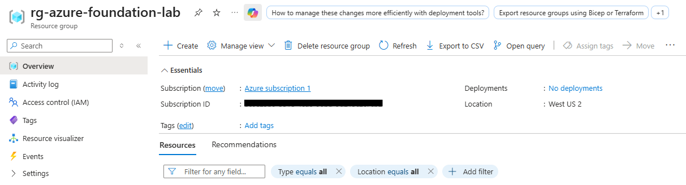

This screenshot shows the dedicated resource group created for the lab. The resource group was used to organize all Azure resources for the project in one place.

### Resource Group Properties

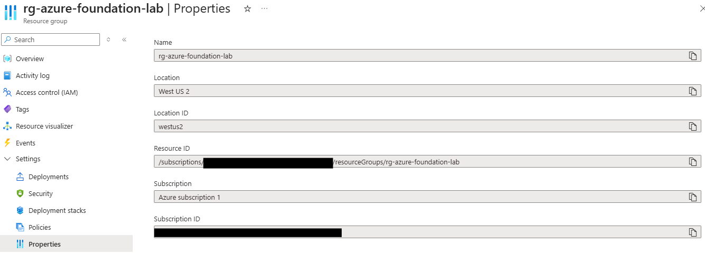

This screenshot shows the resource group properties, including the resource group name, subscription, region, and resource ID.

### Virtual Network Address Space Review

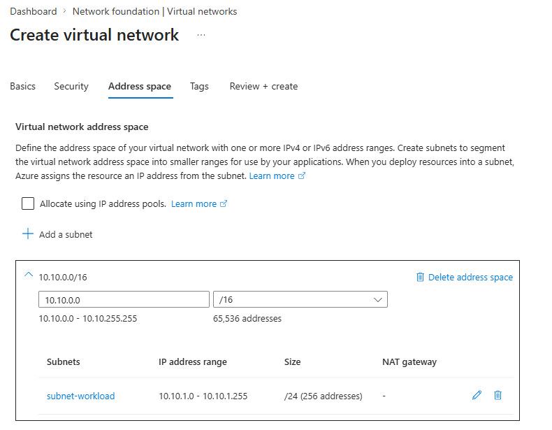

This screenshot shows the virtual network address space and subnet configuration before deployment. The VNet was configured with the `10.10.0.0/16` address space and the workload subnet was configured as `10.10.1.0/24`.

### Virtual Network Overview

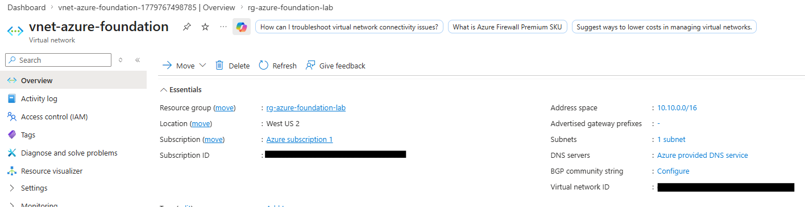

This screenshot shows the deployed virtual network. The VNet provides the private networking foundation for the VM and other Azure resources.

### Virtual Network Subnets

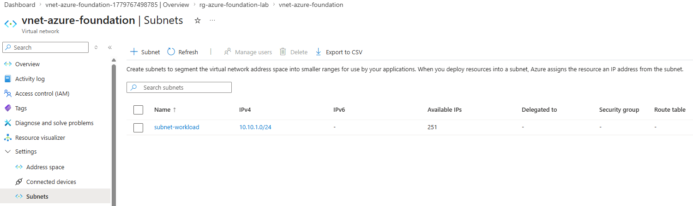

This screenshot shows the configured subnet inside the virtual network. The VM was later deployed into this subnet.

### Network Security Group Overview

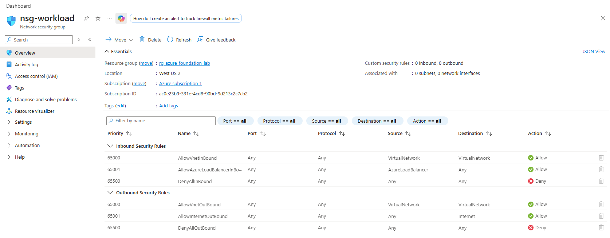

This screenshot shows the Network Security Group created for the workload subnet. The NSG provides traffic filtering for resources connected to the subnet.

### NSG Subnet Association

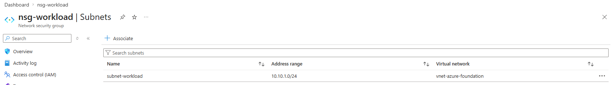

This screenshot shows the Network Security Group associated with the workload subnet. This ensures subnet-level traffic filtering is applied to resources deployed into `subnet-workload`.

### Virtual Machine Deployment Success

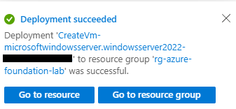

This screenshot shows the successful deployment of the Azure virtual machine.

### Virtual Machine Overview

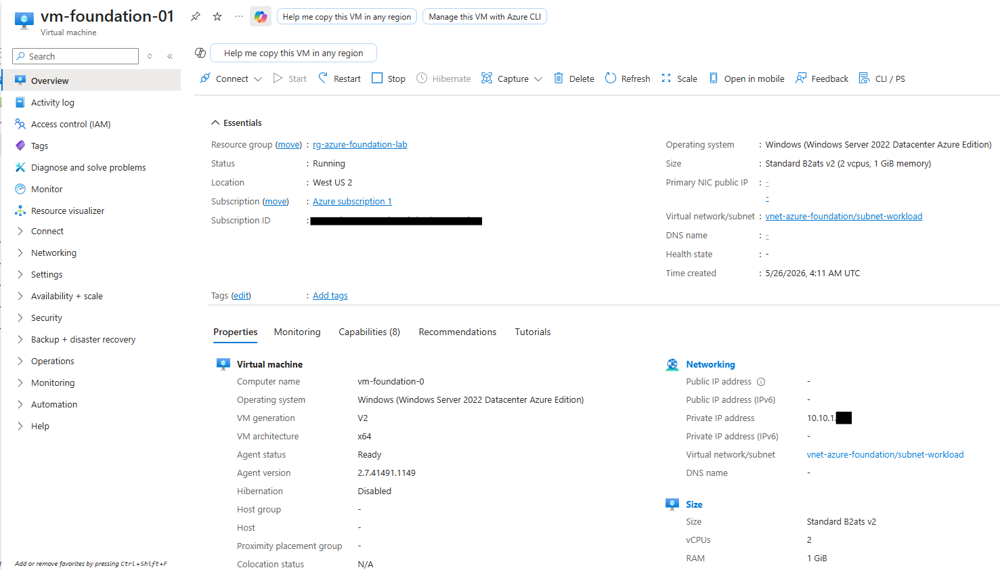

This screenshot shows the deployed VM running in Azure. The VM was assigned a private IP address from the workload subnet and did not have a public IP address, reducing direct exposure to the internet.

### Storage Account Review and Create

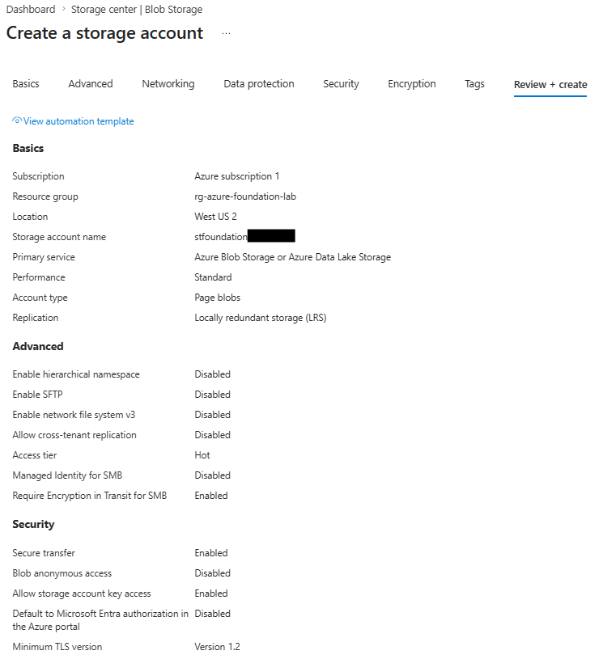

This screenshot shows the storage account settings before deployment, including the selected resource group, region, standard performance tier, LRS redundancy, secure transfer, disabled anonymous blob access, and TLS 1.2.

### Storage Account Overview

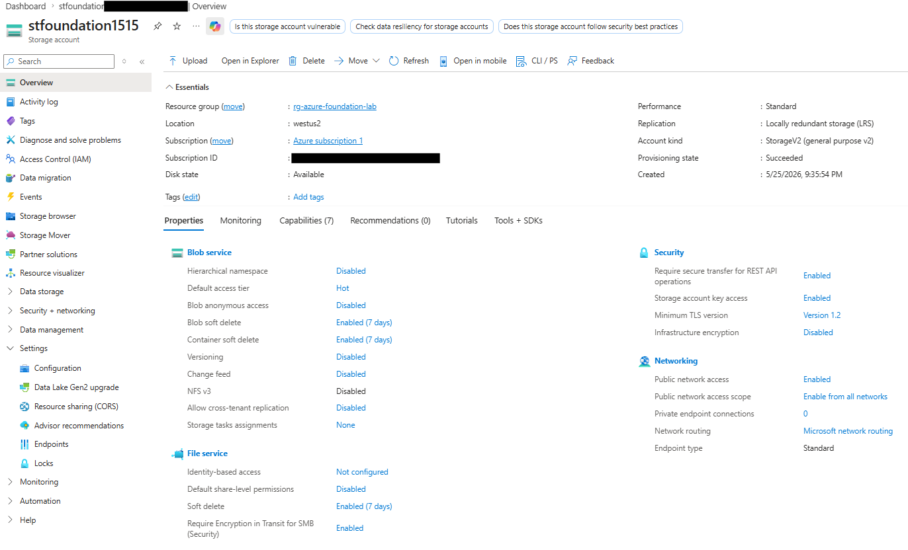

This screenshot shows the deployed Azure storage account. The storage account was created as a standard storage resource for the lab.

### Storage Security Configuration

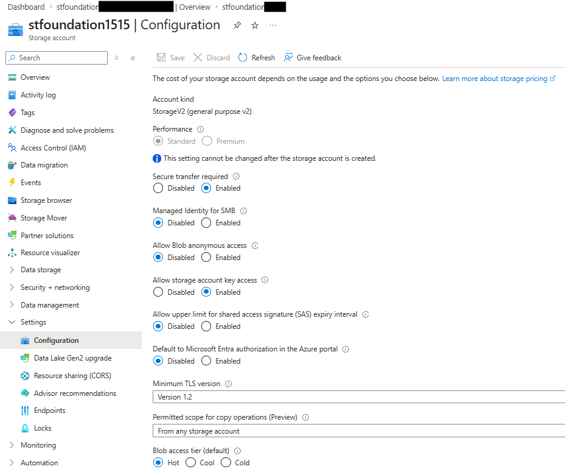

This screenshot shows the storage account security configuration, including secure transfer, disabled anonymous blob access, and minimum TLS version.

### Final Resource Group Resources

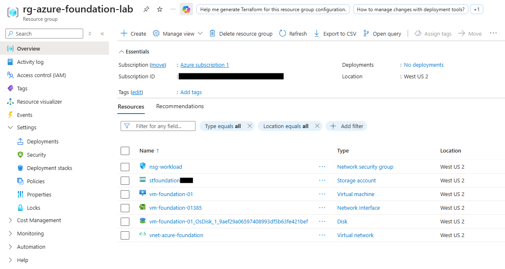

This screenshot shows the final deployed lab environment inside the resource group, including the VM, virtual network, Network Security Group, storage account, network interface, and supporting resources.

## Results

This project successfully demonstrated:

- Deployment of foundational Azure infrastructure through the Azure Portal
- Organization of lab resources inside a dedicated resource group
- Creation of a virtual network and subnet using private IP addressing
- Use of a Network Security Group to apply subnet-level traffic filtering
- Deployment of a Windows Server virtual machine into a private subnet
- VM configuration without a public IP address
- Creation of a standard Azure storage account
- Configuration of basic storage security settings
- Documentation of the full deployment process using screenshots

## Key Takeaways

- Resource groups are useful for organizing and managing related Azure resources together.
- Azure virtual networks provide the private networking foundation for cloud workloads.
- Subnets allow cloud resources to be segmented into smaller network ranges.
- Network Security Groups can be associated with subnets to control traffic flow.
- Deploying a VM without a public IP address reduces direct exposure to the internet.
- Storage accounts should use secure transfer, modern TLS settings, and disabled anonymous access when public access is not required.
- Azure Portal deployment is useful for learning how services connect before automating with tools like Terraform.

## Real-World Relevance

This project relates to real IT and cloud administration work by demonstrating how cloud infrastructure is created, organized, and secured in Azure.

In a business environment, administrators commonly need to:

- Create and organize cloud resources using resource groups
- Build private virtual networks and subnets for workloads
- Apply Network Security Groups to control traffic
- Deploy virtual machines with limited public exposure
- Configure storage accounts with secure baseline settings
- Document cloud infrastructure for operational visibility and future troubleshooting

This lab provides a foundation for future Azure projects involving monitoring, identity and access control, private endpoints, Azure Policy, Microsoft Defender for Cloud, and infrastructure automation.
