# Microsoft Entra ID Identity Security Lab

## Summary

Built a Microsoft Entra ID identity security lab to practice core Microsoft cloud administration and identity protection tasks. This project focused on user lifecycle management, security group organization, role assignment, Entra ID P2 licensing, MFA enforcement, Conditional Access policy testing, and sign-in/audit log review.

The lab was completed as part of my Azure, Microsoft 365, and cloud security preparation for internship work involving Microsoft cloud environments.

## Objective

The goal of this project was to:

- Practice Microsoft Entra ID user, group, and role administration
- Configure identity security controls using MFA and Conditional Access
- Review audit logs and sign-in logs to validate administrative and authentication activity
- Build hands-on familiarity with Microsoft cloud identity workflows used in real IT and security operations

## Tools & Technologies

- Microsoft Azure Portal
- Microsoft Entra ID
- Microsoft Entra ID P2 Trial
- Conditional Access
- Multifactor Authentication
- Entra ID Audit Logs
- Entra ID Sign-in Logs

## Environment

| Component | Details |
|---|---|
| Cloud Platform | Microsoft Azure |
| Identity Platform | Microsoft Entra ID |
| Security Features | MFA, Conditional Access, Entra ID P2 |
| Test Users | Alex Smith, John Doe, Jane Janet |
| Test Roles | Helpdesk Technician, Standard User, Cloud Administrator |

## What I Configured

- Created a monthly Azure budget alert to monitor lab spending
- Reviewed the Azure subscription and Microsoft Entra ID tenant overview
- Created test users for standard user, helpdesk, and cloud administrator scenarios
- Created security groups to organize users by access level and job function
- Activated the Microsoft Entra ID P2 trial in the original lab tenant
- Assigned Entra ID P2 licenses to lab users
- Assigned a limited administrative role to the helpdesk test user
- Reviewed audit logs to verify user, group, and role changes
- Created a Conditional Access policy requiring MFA for administrative users
- Tested MFA registration and successful sign-in with the helpdesk test user
- Reviewed sign-in logs to confirm MFA and Conditional Access evaluation
- Created a report-only Conditional Access policy to block non-US sign-ins

## Screenshots

### Azure Budget Alert

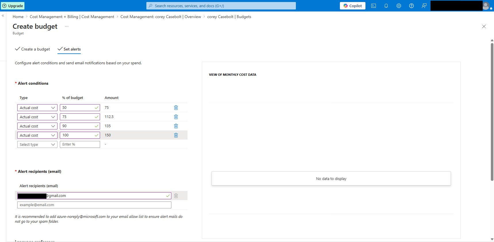

Created a monthly Azure budget alert to help monitor lab spending and reduce the risk of unexpected cloud costs.

### Microsoft Entra ID Overview

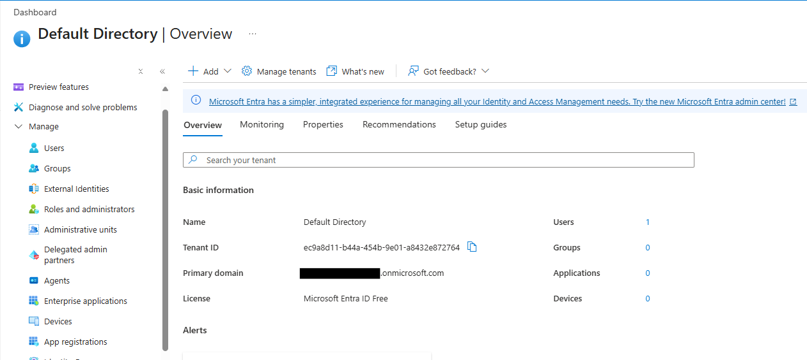

Reviewed the Microsoft Entra ID tenant overview to identify the tenant, primary domain, and core identity management areas.

### Test Users Created

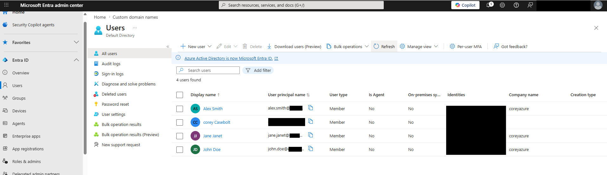

Created test users to simulate standard employee, helpdesk, and cloud administrator identity scenarios.

### Security Groups Created

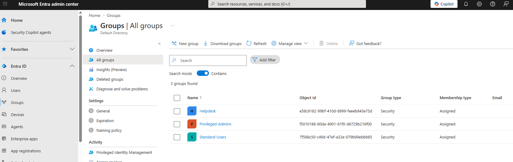

Created security groups to organize users by role and prepare for access control and Conditional Access testing.

### Entra ID P2 License Active

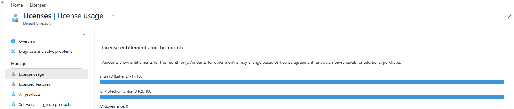

Confirmed that the Microsoft Entra ID P2 trial was active in the original lab tenant.

### Entra ID P2 License Assignments

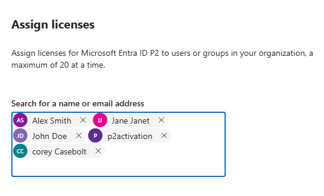

Assigned Microsoft Entra ID P2 trial licenses to lab users to enable advanced identity security features.

### Helpdesk Administrator Role Assignment

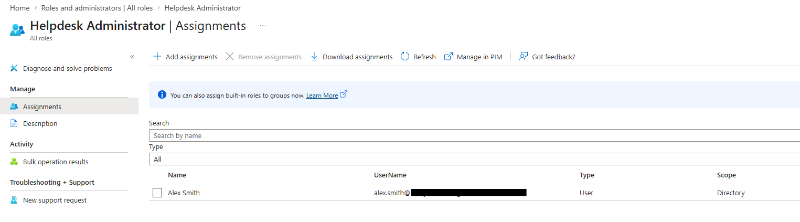

Assigned a limited administrative role to the helpdesk test user to practice least-privilege access.

### Audit Log Role Assignment

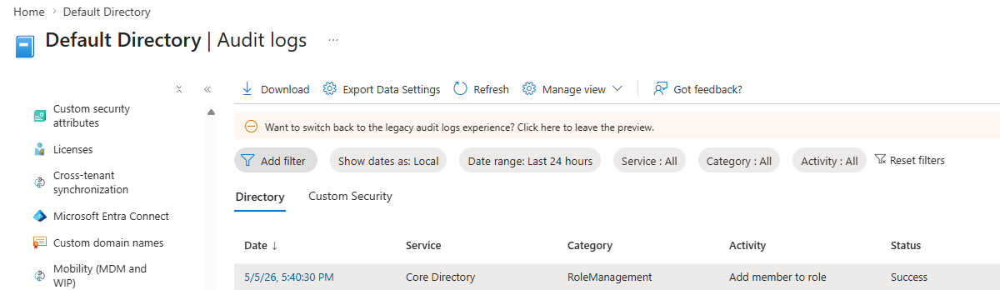

Verified that the administrative role assignment was recorded in Microsoft Entra ID audit logs.

### Conditional Access Admin MFA Policy

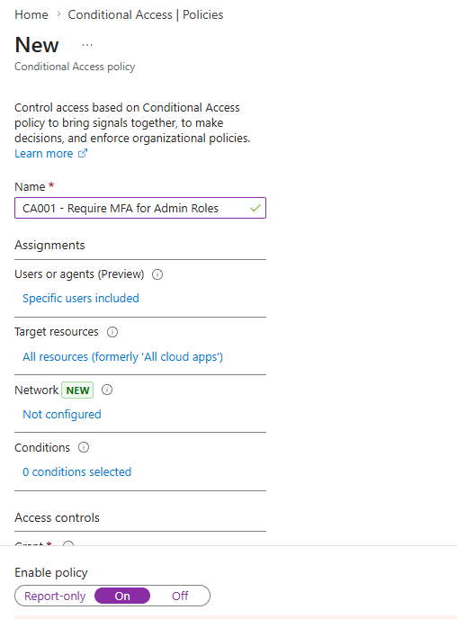

Created a Conditional Access policy requiring multifactor authentication for administrative test users.

### Alex Smith Conditional Access MFA Success

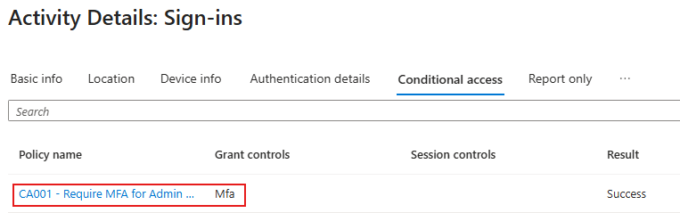

Reviewed a successful sign-in event for the helpdesk test user and confirmed that multifactor authentication was required and the Conditional Access policy evaluated successfully.

### Conditional Access Block Non-US Policy

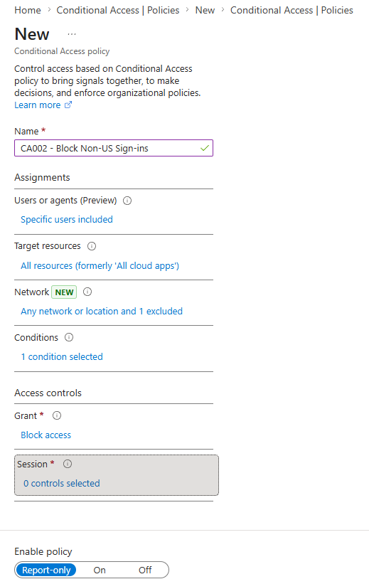

Created a report-only Conditional Access policy to block non-US sign-ins for lab users using a named United States location exclusion.

## Results

This project successfully demonstrated:

- Basic Microsoft Entra ID user and group administration
- Entra ID P2 license activation and assignment
- Least-privilege role assignment for a helpdesk-style user
- MFA registration and successful MFA-protected sign-in
- Conditional Access policy creation and validation
- Audit log review for administrative accountability
- Sign-in log review for authentication and access control evidence

## Key Takeaways

- Microsoft Entra ID is the central identity platform for Azure and Microsoft 365 environments.
- Security groups help organize users and simplify access management.
- Administrative roles should be assigned using least privilege whenever possible.
- MFA and Conditional Access are important identity security controls for protecting privileged accounts.
- Audit logs and sign-in logs provide evidence of administrative activity, authentication behavior, and policy evaluation.
- Report-only mode is useful for testing Conditional Access policies before enforcement.

## Real-World Relevance

This project relates to real IT and security operations by demonstrating:

- User and group management tasks common in Microsoft 365 administration
- Identity security controls used to protect cloud accounts
- Privileged access monitoring through audit logs
- Authentication investigation using sign-in logs
- Safe Conditional Access testing before enforcement
- Cloud security practices relevant to managed services, helpdesk support, and SOC workflows
